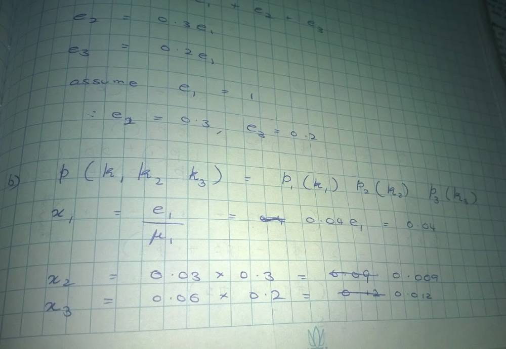
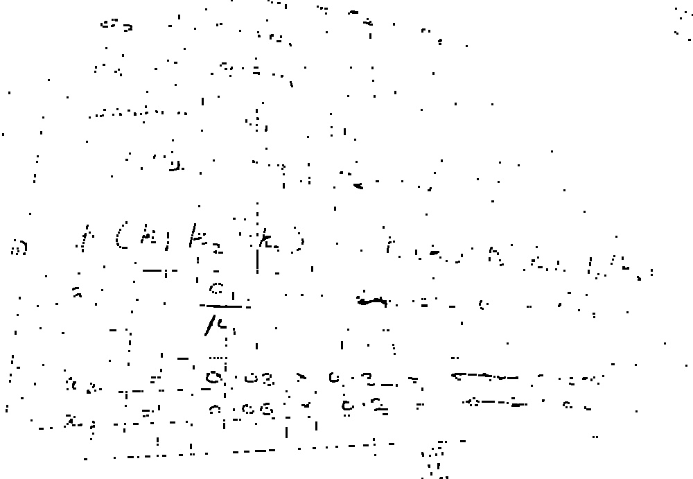
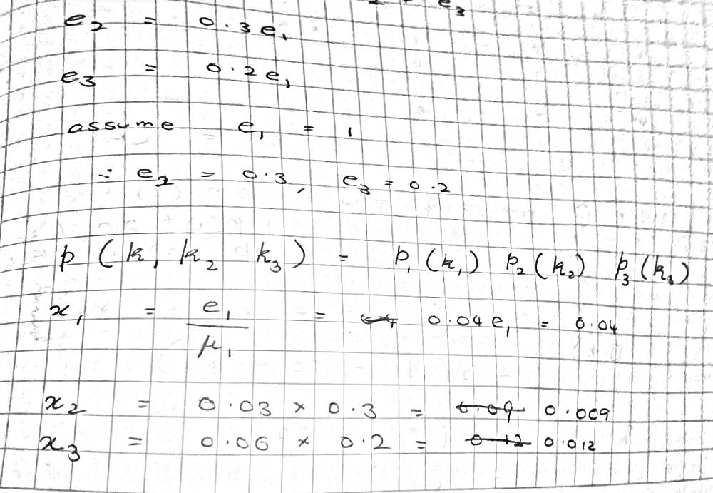

<h1>AIM</h1>
a script which takes in raw photos of text with shadows lighting and orientation issues and convert it into a b/w clean printable output
without greying out the whole paper,speckling,blurring/fainting of text.

### Original

### Current

### Target

[Photo source](https://janithl.github.io/2021/12/remove-shadows-and-uneven-lighting/)